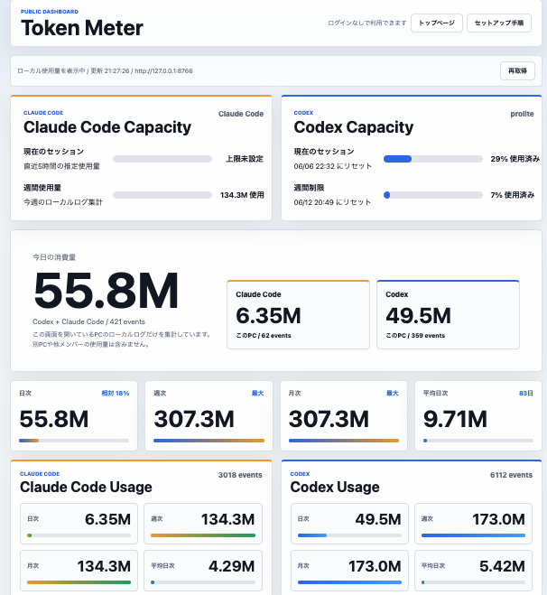

# Token Meter



Codex と Claude Code のトークン使用量を確認するためのダッシュボードです。UI の見た目方針はリポジトリ直下の `DESIGN.md`（Operations Console）を参照してください。

公開版:

https://token-meterz.vercel.app/

トップ画面はログインなしで使える仕様です。

契約プランは自動取得ではなく、トップ画面下部の「契約プラン（手動設定）」でブラウザに保存します。

## アプリとしてインストール

Token Meter はPWAとしてインストールできます。

- Chrome / Edge: アドレスバー右側のインストールアイコン、またはメニューの「キャスト、保存、共有」から「ページをアプリとしてインストール」を選びます。
- Safari / iPhone: 共有メニューから「ホーム画面に追加」を選びます。

インストール後も、ローカル使用量を表示するには各PCでローカル版 Token Meter の自動起動設定が必要です。

## セットアップ

公開版だけでは、各自のPC内にある Codex / Claude Code のローカルログを直接読むことはできません。

自分の使用量を表示するには、各自のPCでローカル版 Token Meter を裏側で起動しておく必要があります。

一度だけ自動起動を登録しておけば、次回以降はターミナルを開かなくても使えます。

公開版は、ブラウザ経由でその人のPCの `http://127.0.0.1:8766/api/usage` を読みます。

8766で見つからない場合は、ローカル単体起動の既定ポートである `http://127.0.0.1:8765/api/usage` も自動で試します。

画面に出る「今日の消費量」「Claude Code」「Codex」の数字は、その画面を開いているPCのローカルログだけを集計したものです。

別PCで使った分や、他メンバーの使用量は含みません。複数PCや会社全体の数値を見たい場合は、今後、各PCの集計結果だけをDBへ報告・同期する仕組みを追加する想定です。

## Mac の手順

1. Python 3 を入れる

https://www.python.org/downloads/macos/

ターミナルで確認します。

```bash
python3 --version
```

バージョンが表示されれば、そのまま次へ進めます。

`python3 --version` でバージョンが出ない場合だけ、Python 3 を入れてください。

画面から入れる場合:

https://www.python.org/downloads/macos/

ターミナルで入れる場合は Homebrew を使います。まず Homebrew が入っているか確認します。

```bash
brew --version
```

Homebrew が入っている場合:

```bash
brew install python
```

`zsh: command not found: brew` と出る場合は、Homebrew が入っていません。以下で Homebrew を入れてから Python 3 を入れます。

```bash
/bin/bash -c "$(curl -fsSL https://raw.githubusercontent.com/Homebrew/install/HEAD/install.sh)"
brew install python
```

2. このリポジトリを取得する

```bash
git clone https://github.com/skylandvc/token-meter.git
cd token-meter
```

3. 自動起動を登録する

Finder で `install-mac-autostart.command` をダブルクリックします。

登録後は、Macへログインした時に Token Meter が裏側で自動起動します。

今すぐ起動したい場合は、以下を実行します。

```bash
cd ~/token-meter
PORT=8766 python3 server.py
```

Finder から `start.command` をダブルクリックして起動することもできます。

`can't open file '/Users/.../server.py'` と出る場合は、`token-meter` フォルダに移動できていません。先に `cd ~/token-meter` を実行してください。

4. 公開版を開く

https://token-meterz.vercel.app/

5. `ローカル版から取得` を押す

自動起動を解除したい場合は、`uninstall-mac-autostart.command` をダブルクリックします。

うまく表示されない場合は、同じブラウザで以下を開いてください。

```text
http://127.0.0.1:8766/health
```

`{"ok": true}` と出ればローカル版は起動しています。出ない場合は `start.command` を一度実行してください。

## Windows の手順

1. Python 3 を入れる

https://www.python.org/downloads/windows/

2. このリポジトリを取得する

```powershell
git clone https://github.com/skylandvc/token-meter.git
cd token-meter
```

3. 自動起動を登録する

Explorer で `install-windows-startup.bat` をダブルクリックします。

登録後は、Windowsへログインした時に Token Meter が裏側で自動起動します。

今すぐ起動したい場合は、以下を実行します。

```powershell
$env:PORT=8766
python server.py
```

Explorer から `start-windows.bat` をダブルクリックして起動することもできます。

4. 公開版を開く

https://token-meterz.vercel.app/

5. `ローカル版から取得` を押す

自動起動を解除したい場合は、`uninstall-windows-startup.bat` をダブルクリックします。

うまく表示されない場合は、同じブラウザで以下を開いてください。

```text
http://127.0.0.1:8766/health
```

`{"ok": true}` と出ればローカル版は起動しています。出ない場合は `start-windows.bat` を一度実行してください。

## 常時使うための考え方

Vercel版だけで、各自のPC内にある Codex / Claude Code のログを直接読むことはできません。

そのため、常時使う方法は次のどちらかです。

- 各PCでローカル版 Token Meter を自動起動する
- 将来的に、ローカル集計結果だけを Notion DB や別DBへ同期して公開版で読む

現在は前者の方式です。会話本文やraw JSONLログは公開サーバーへ送りません。

## ローカル版だけで見る場合

```bash
python3 server.py
```

ブラウザで開きます。

```text
http://127.0.0.1:8765
```

8766番ポートで起動したい場合:

```bash
PORT=8766 python3 server.py
```

## 読み取るログ

- Codex: `~/.codex/sessions/**/*.jsonl`
- Codex: `~/.codex/archived_sessions/**/*.jsonl`
- Claude Code: `~/.claude/projects/**/*.jsonl`

ローカル版は、上記のJSONLログを読み、日次・週次・月次・平均日次・最近のイベント・Codexのrate limit情報を集計します。

会話本文やrawログを公開サーバーへ送る設計にはしていません。

## Vercel の設定

現在のトップ画面はログインなしで利用できます。

将来的に、トークン画面の表示結果を会社へ報告する機能を追加する場合は、以下のような方式を検討します。

- 表示した集計結果だけを送信する
- 送信前にユーザーへ確認画面を出す
- raw JSONLログや会話本文は送信しない
- 必要に応じてGoogleログインで利用者を識別する
- Notion DB や別DBに日次スナップショットとして保存する

Googleログインを再度使う場合は、Vercel の Environment Variables に以下を設定します。

```text
AUTH_SECRET=...
AUTH_GOOGLE_ID=...
AUTH_GOOGLE_SECRET=...
ALLOWED_EMAIL_DOMAINS=skyland.vc
ALLOWED_EMAILS=
PUBLIC_ACCESS=false
```

Google OAuth の Redirect URI:

```text
https://token-meterz.vercel.app/api/auth/callback/google
```

## 開発者向け

Next.js の公開版をローカルで起動します。

```bash
npm install
npm run dev
```

Python版のローカルAPIを起動します。

```bash
PORT=8766 python3 server.py
```

## 注意

このアプリはローカルファーストです。

公開版で各自の使用量を出す場合も、ブラウザが各自のPCの `127.0.0.1:8766` または `127.0.0.1:8765` を読むだけです。raw JSONLログをVercelへアップロードする設計ではありません。

ローカルAPIは、標準では以下の画面からのアクセスだけを許可します。

- `https://token-meterz.vercel.app`
- `http://127.0.0.1:3000`
- `http://127.0.0.1:8765`
- `http://127.0.0.1:8766`
- `http://localhost:3000`
- `http://localhost:8765`
- `http://localhost:8766`

許可する画面を追加する場合は、ローカル版の起動時に `TOKEN_METER_ALLOWED_ORIGINS` をカンマ区切りで指定します。

```bash
TOKEN_METER_ALLOWED_ORIGINS=https://token-meterz.vercel.app,http://127.0.0.1:8766 PORT=8766 python3 server.py
```

将来的にNotion DB同期を入れる場合も、保存するのは集計済みスナップショットに限定する方針です。
